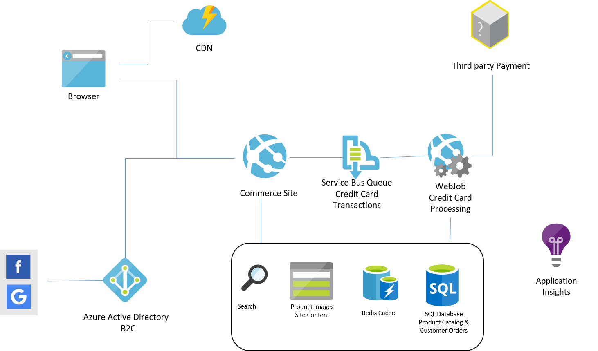

# Basic E-Commerce Solution
A basic e-commerce solution is a highly scalable data-driven web application that integrates a shopping experience with 3rd-party payment systems. The Web application is secured using Azure Active Directory B2C. Azure SQL Database provides product catalog, session state and transaction processing and a third-party payment service should be used to securely handle credit card transactions passed to it from the Service Bus queue and WebJob. This Azure Resource Template project deploys a set of resources based on the below solution architecture that collectively provide the framework for the creation of a basic e-commerce web site.

# Create a basic e-commerce site infrastructure using a template

## Setup Azure Active Directory B2C for your e-commerce site
Once you have deployed the template succesfully you can set up Azure Active Directory B2C so that it is available to secure your applicaiotn by follwing the instructions [Here](SaaSecommerce/Docs/ADB2CSetup.md)

For information about using this template, see below.

## Resources
The template deploys the following resources to Azure:

1. Azure App Services Hosting Plan
2. Azure App Services Web Site (to host the ecommerce site)
3. Azure App Services Web Site (to host the webjob that will process your orders)
4. Redis Cache instance
5. Azure SQL with two databases: ProductCatalog and Orders
6. Azure storage (to hold blob and table stores)
7. Azure Search
8. CDN service configured with host header of web site as source url
9. Service Bus Namespace to allow you to create Queues for your transactions
10. Application Insights instance and alerts for Azure web sites

> All resources inherit their deployment location to that of the containing resource group, with the exception of the Application Insights service, which at time of creation is restricted to CentralUS.

> All resources are given a unique name through a combination of a prefix, set through the template parameters, followed by a unique string derived from the resource group ID.

## Parameters:
* __NamePrefix__: This string is used as a standard prefix for all resource names in the deployment. Resource names themselves are defined by variables.
* __SqlAdminLogin__: Provides the account name for the SQL sa login. Note that this cannot be 'admin'.
* __SqlAdminLoginPassword__: Provides the SQL sa login password. Note that this must be a securestring and not plain text.
* __AppPlanSKU__: Sets the SKU fo the App Services hosting plan that will contain the web sites for the solution.
* __AppPlanWorkerSize__: Sets the size (small, medium, large) of the hosting plan.
* __StorageType__: Specifies the tier (for performance, resilience and price) of the Azure storage account.
* __SearchSKU__: Specifies the service tier of the Azure Search instance.
* __AppInsightsLocation__: Specifies the deployment location for AppInsights. At the time of creation only *CentralUS* is allowed, but the parameter will make it easier to change in future.

## Outputs:
To ease integration with Release Management this template provides key values as outputs.
* __WebSiteHostName__: The assigned default hostname for the Azure web site.
* __WebJobSiteHostName__: The assigned default hostname for the Azure web site hosting the webjob.
* __RedisCacheHostName__: The assigned default hsotname for the Redis Cache instance.
* __StorageBlobEndpoint__: The URL for the storage account blob endpoint.
* __StorageKey__: The primary key for the storage account, as a securestring.
* __SQLServerFQDN__: The assigned fully qualified domain name for the Azure SQL instance.

## Notes:
1. AppInsights is available in *EastUS*, *NorthEurope* and *WestEurope* the *allowedValues* for the *AppInsightsLocation* parameter are set accordingly. To change, once the service is allowed elsewhere, add the new locations to the list of values.
2. The API version for Azure SQL is *2014-04-01-preview* and has been set by the tooling on creation of the template. At the time of creation, all automated rooling sets this version. Preview APIs can be retired so this value should be updated accordingly to match the live service.
